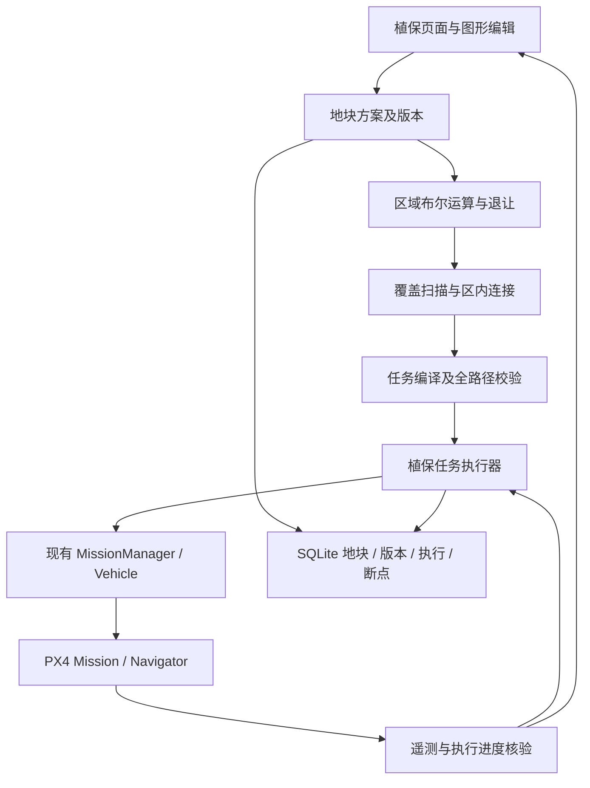

# ADR-0001：植保区域覆盖飞行初版方案

- 日期：2026-09-20
- 方案版本：0.1
- 状态：**设计基线已确定，待实现与验证**。本文不表示相关功能已经实现或通过实飞验收。
- 适用工程：MERIVUS GroundStation；执行端为本项目 PX4 多旋翼。
- 源码核查基线：GroundStation `d489b95`；FirmwarePX4 `ff921fa098`。文档落在独立分支 `docs/area-coverage-plan`。
- 决策来源：本次需求访谈中用户明确接受的需求，以及用户授权首席方案规划师补齐的工程决策。前者见第 2 节，后者见第 3～12 节。
- 本文是该功能的初版设计真相源；功能实现状态仍由项目状态文档记录。后续变更更新此 ADR 或以新 ADR 明确替代，不维护互相冲突的方案副本。

## 1. 项目目标与交付边界

在飞行主界面增加两字按钮 **“植保”**。用户在地图中组合、编辑作业图形，得到一块连通且允许含孔洞的绿色作业区。地面站计算面积与覆盖航线，经用户确认后上传完整任务，由 PX4 执行。

第一版完成单机、空中启动、区域覆盖、区内换行、正常完成后返回作业前位置悬停，以及暂停、继续、终止、历史方案复用。默认作业高度为起飞点相对高度 10 m，默认虚拟作业宽度为 1 m，均可修改。

本期验收的是地图规划、任务控制和飞行执行。没有喷洒设备，不能将估算覆盖面积称为真实喷药面积。自动起飞、仿地、感知避障、喷洒控制和多机协同不进入本期交付；数据和模块边界允许后续独立扩展。

## 2. 已确认需求

| 编号 | 已定要求 | 产品含义 |
|---|---|---|
| R01 | 单机作业 | 一个执行实例绑定一架飞机；切换当前查看对象不改变任务归属 |
| R02 | 地面站规划，飞控执行 | 边界不直接作为飞行航点；生成完整航线后通过 MAVLink Mission 上传 |
| R03 | 区域不限四角、不限矩形 | 支持矩形、圆形、扇形、环形与闭合不规则多边形 |
| R04 | 多图形可编辑组合 | 浮动绘图工具条；允许连续添加、拖动、缩放、旋转、改点；点击“确认区域”才结束选区 |
| R05 | 图形添加和排除 | 完全落在绿色区内的新图形默认排除，其余默认添加；允许手动切换，拖动不改变角色 |
| R06 | 绿色表示作业区 | 内部排除区不填绿色，具有清晰边界；环形中心建筑不可穿越 |
| R07 | 每次一块连通区域 | 可以有多个孔洞；不在同一次任务中跨越两块分离地块 |
| R08 | 地理方向固定 | 首个覆盖行从西向东，其后交替；覆盖行从北向南排列，不随地图旋转 |
| R09 | 默认宽度 1 m，可修改 | 是规划使用的虚拟作业宽度，当前不绑定真实喷头 |
| R10 | 默认高度 10 m，可修改 | 相对起飞点/Home 高度，非距地或距作物高度 |
| R11 | 空中启动 | 第一版不自动解锁起飞；飞机已起飞后才能开始或继续执行 |
| R12 | 可在作业区外开始 | 点击开始记录当时飞机的位置和相对高度，自动进入作业区 |
| R13 | 覆盖与换行不出区 | 覆盖期间的连接路线绕过孔洞，保持在绿色范围；进场、返程允许在区域外 |
| R14 | 正常完成返回并悬停 | 回到本次开始记录的位置和高度；不是通用 RTL，不要求降落 |
| R15 | 暂停、继续、终止 | 暂停保存进度后悬停，可继续；主动终止原地悬停，不自动返回 |
| R16 | 多地块与历次作业管理 | 支持命名、加载、修改、删除；重启地面站后仍能读取历史与断点 |
| R17 | 修改方案形成新一轮 | 边界、宽度等执行参数改变后生成新版本、新任务；原记录按原方案继续；名称、备注不影响断点 |
| R18 | 可重复作业 | 历史方案可反复从头执行，每轮重新记录返回点；为未来地面加载后自动起飞保留入口 |
| R19 | 可配置边界安全距离 | 外边界内缩、排除区外扩；无法覆盖的边缘明确显示，不能虚报涂满 |
| R20 | 完成后界面收尾 | 返回点悬停确认、记录持久化后，收起作业页回到主界面；销毁视图不能销毁任务数据 |
| R21 | 后续喷洒可接入 | 区分覆盖、换行、进场、返程航段，未来可按航段启停作业设备 |

“从北向南”约束覆盖行的执行顺序。绕建筑的连接段允许局部向北或侧向绕行，否则部分环形、凹形区域没有可行解；连接段不算新增覆盖行，也不能跨越排除区。

## 3. 借鉴对象与最终技术取舍

| 来源 | 本项目采用什么 | 不采用什么／原因 |
|---|---|---|
| DJI T20 Agras | 地块与障碍分开编辑、行距/高度设置、预览后启动、暂停与断点续作、执行结束动作的产品流程 | 不复制其封闭协议、硬件能力或宣称同等实飞性能 |
| DJI T50 Agras | 把测绘、感知、仿地、实时避障与静态任务规划分层的能力划分 | 第一版不实现双目、雷达融合与自动绕障 |
| QGC 地图编辑与 MissionManager | 地图交互、坐标模型、既有任务传输/ACK/重试、Vehicle 控制入口 | 不把 Survey 航测界面直接改名为植保；不照搬区域外转弯策略 |
| Fields2Cover | 带孔/凹形区域处理、往返覆盖与连接路径分开的算法结构，作为离线对照 | 第一版不引入整套 GDAL、GEOS、OR-tools 依赖，不照搬农业车辆 Dubins/Reeds-Shepp 转弯模型 |
| ArduPilot ZigZag / Sprayer | 覆盖段与换行阶段分离，未来作业设备依据阶段和速度管理 | 不迁移其飞行模式或喷洒代码到 PX4，不切换飞控栈 |
| Clipper2 C++ | **采用其布尔运算、偏移和带孔结果表示**，服务于组合图形、退让和覆盖校验 | 不使用其三角剖分模块，不用屏幕像素填色充当任务几何计算 |
| 小型 GitHub 覆盖项目 | 仅作可视化样例与算法结果对照 | 不作为机载执行或可靠性依据 |
| PX4-Avoidance 旧实现 | 仅了解历史接口边界 | 不新增对已归档避障栈的依赖 |

上述产品和库的事实依据分别为 [T20 官方手册](https://dl.djicdn.com/downloads/t20/20201110/Agras_T20_User_Manual_v1.2_EN.pdf)、[T50 官方 FAQ](https://ag.dji.com/t50/faq)、[QGC Survey](https://docs.qgroundcontrol.com/master/en/qgc-user-guide/plan_view/pattern_survey.html)、[Fields2Cover](https://github.com/Fields2Cover/Fields2Cover)、[ArduPilot ZigZag](https://ardupilot.org/copter/docs/zigzag-mode.html)、[Sprayer](https://ardupilot.org/copter/docs/common-sprayer.html) 和 [Clipper2](https://github.com/AngusJohnson/Clipper2)。表中“采用/不采用”为本项目决策，不是对方产品的实现声明。

### 3.1 几何与存储选型

- 几何代码运行在 GroundStation C++ 工作线程，UI 不自行计算第二份航线。
- Clipper2 初始依赖锁定 **1.5.4 / `ef88ee97c0e759792e43a2b2d8072def6c9244e8`**，只编入所需 C++ 核心/裁剪/偏移源码，保留 BSL-1.0 许可；不依赖运行时下载 DLL。版本来源：[官方发布提交](https://github.com/AngusJohnson/Clipper2/commit/ef88ee97c0e759792e43a2b2d8072def6c9244e8)。该版本是初始评估基线，尚未在本工程编译；必须通过本方案测试后才能随产品发布，若有阻塞缺陷则升级并记录替代版本。
- 经纬度投影复用工程已有的 GeographicLib 横轴墨卡托实现，建立以地块参考经线为中心、尺度因子为 1 的当地米制坐标。固定该参考，不逐点切换 UTM 分区，不按屏幕像素或经纬度差计算米数。
- 第一版以地块参考点真北作为统一方向；大范围投影误差纳入几何误差预算，超预算时禁止上传并给出拆分地块说明。初始验证范围为距参考点 5 km 内的普通农业地块，范围本身不代替数值误差检查。
- 持久化采用 **Qt SQL + SQLite**，放入 `QStandardPaths::AppDataLocation` 下的产品数据目录。数据库是唯一持久真相源，不再并行维护一份可写 JSON 历史文件。
- 几何输入用 WGS84；规划计算单位为米；所有高度值与其参考系成对保存。显示亩/公顷只是单位换算，不影响内部计算。
- 地图瓦片与取点接口必须登记坐标基准，避免把 GCJ-02/BD-09 或存在配准偏差的底图坐标当成 WGS84 直接上传。转换只在地图适配边界执行一次，已转换输入不得重复偏移；地图配准误差仍进入能力档案。

### 3.2 当前源码可复用范围

| 当前源码 | 已核实内容 | 实现决策 |
|---|---|---|
| `custom/res/Merivus/FlyViewMap.qml` | 普通右键即时指点；Shift+右键建立任务草稿 | 复用地图事件和坐标转换，按编辑状态分派事件；植保编辑时右键不得下发即时指点 |
| `custom/src/Swarm/SwarmController.cc` | 队列经 MissionManager 上传后启动；末点附近低速时暂停、清空 | 不直接用这个临时任务生命周期管理植保；不复制其编队坐标平移逻辑 |
| `src/MissionManager/MissionManager.*`、`PlanManager.*` | 上传事务、当前序号、恢复任务辅助逻辑 | 复用传输；植保负责航段映射、断点规划和运行状态。已有序号恢复不是本期完整断点恢复能力 |
| `src/MissionManager/SurveyComplexItem.cc` | 扫描线求交函数存在取最远两交点的分支 | 不把该函数直接用于含建筑孔洞的作业区 |
| `QGCMapPolygon.*`、`QGCMapCircle.*` 及 Visuals | 顶点、圆心、半径及交互基础 | 复用操作模式与组件；组合区及孔洞显示由统一区域模型提供 |
| `src/Geo/TransverseMercator.*`、`QGCGeo.*` | 工程已有米制投影基础；普通 NED 转换使用球面近似 | 植保精度检查使用统一投影适配器，不在 QML 中散落球面近似计算 |
| PX4 `src/modules/navigator/mission_block.cpp` | 多旋翼可使用任务项的显式接受半径，支持无限悬停任务项 | 用标准任务构建低速、可检查的转折与末端悬停；不能以默认接受半径保证 1 m 覆盖 |

当前队列结束条件中的 2 m 距离、0.8 m/s 速度以及 PX4 源码中的默认 `NAV_ACC_RAD=10 m`，都只是当前实现事实，**不是本功能的验收阈值或实际飞机参数值**。

## 4. 页面与交互流程

### 4.1 页面组成

- 主界面入口：两字按钮“植保”。打开左侧作业面板，地图仍为主画布。
- 面板包含“地块”“规划”“执行”“记录”四个视图，复用同一任务上下文，不建立多个互相竞争的控制器。
- 选区时显示浮动工具条：选择/移动、矩形、圆形、扇形、环形、多边形、添加/排除、撤销、重做、删除选中、确认区域、取消编辑。
- 矩形支持长宽与旋转；圆支持圆心与半径；扇形支持半径、起止角与旋转；环形支持内外半径；多边形支持增删和拖动顶点。所有图形允许整体移动。
- 圆形保持圆形；用户需要任意拉伸时转换为可编辑多边形，不把圆形参数悄悄解释为椭圆。
- 圆弧显示平滑；转换到规划多边形时采用有误差上界的离散化，保留原始圆/扇形参数供下次编辑。

### 4.2 多图形组合语义

添加图形集合为 `A`，排除图形集合为 `E`：

```text
R = Union(A) - Union(E)
```

1. 第一个有效图形默认为添加。
2. 后续新图形完全处于当前绿色区内时默认排除，否则默认添加；工具条即时显示其角色，确认前允许修改。
3. 角色一旦确定，在拖动、缩放和重载时保持不变。
4. 排除图形优先。要恢复已排除部分，编辑或删除对应排除图形；叠一个添加图形不会悄悄覆盖排除约束。
5. 环形工具内部生成一组关联的外部添加轮廓和内部排除轮廓，作为一组编辑。两个同心圆也能形成相同结果。
6. 孔洞不是白色盖板；它必须在几何、面积、航线、命中测试和保存结果中都存在。
7. 最终非空且只有一块连通绿色区才可确认；相互接触但没有有效通道的区域还需经过安全退让后的连通性检查。
8. 多边形至少三个不同顶点，必须闭合。支持凹多边形；重复点、零面积、自交边等输入给出具体编辑提示，不将“不规则”本身作为拒绝原因，也不擅自用凸包修改边界。

### 4.3 页面操作顺序

```text
植保 → 新建/加载地块 → 编辑组合图形 → 确认区域
     → 调整参数 → 预览覆盖、连接、进场与返程 → 开始作业
     → 上传核验 → 执行 → 返回记录点 → 悬停确认 → 保存结果 → 主界面
```

“确认区域”仅冻结本次几何编辑，不立即上传、启动或退出页面。“开始作业”使用现有人工引导确认样式，展示实际绑定飞机、方案版本、当前返回位置、范围与航点数。最终确认时采样并持久化本轮返回锚点；与预览相比若飞机已明显移动，重新检查进场路线后才上传。

绘图期间，普通右键采点不调用 `executeGoto`，Shift 队列也不混入植保草稿。执行期间普通右键指点入口被任务占用，用户须先暂停/终止；遥控接管和 PX4 故障保护始终优先。

关闭执行面板只收起视图，主界面保留任务状态与暂停入口，不终止机载任务。正常完成且确认悬停后自动回主界面；暂停、终止和异常状态保留结果/处置界面，不用自动关闭掩盖异常。

### 4.4 地图与统计

| 信息 | 表示 |
|---|---|
| 作业区 | 浅绿色半透明 |
| 排除区 | 无绿色填充，红色边界/斜线 |
| 因退让无法覆盖的边缘 | 橙色斜线，不混入完成绿色 |
| 待执行覆盖段 | 蓝色实线与方向箭头 |
| 换行/绕行连接 | 灰色虚线 |
| 进场/返程 | 独立标记的紫色虚线 |
| 有证据完成的覆盖段 | 深绿色；遥测缺失部分显示未知 |
| 暂停点、返回点 | 不同图标与文字，不能混用 Home 图标 |

同时显示选区净面积、规划可覆盖面积、边缘未覆盖面积、规划覆盖率、覆盖路程、连接路程、预计时间及航点总数。执行进度与实际轨迹估算覆盖率分开；面积展示单位为 m²，可切换亩/公顷（1 公顷=10000 m²，1 亩=2000/3 m²）。

## 5. 参数与飞行能力配置

下表数值分为用户确认值和本方案初始工程值。初始工程值用于实现、Mock/SITL 调试；真实飞机必须以验证过的能力档案约束，不视为通用实飞推荐。

| 参数 | 第一版决策 | 调整规则 |
|---|---|---|
| 作业高度 | 10 m，相对起飞点/Home | 用户可改，必须落在飞控限制和已验证范围内 |
| 虚拟作业宽度 `w` | 1 m | 用户可改，必须为有限正数；不得拿机体宽度替代 |
| 重叠率 `r` | 10%，初始工程值 | 高级选项，`0 ≤ r < 1`；实际误差检查可能要求更大重叠 |
| 行距 `s` | `w × (1-r)` | 派生只读显示，避免宽度/行距两个可写入口互相矛盾 |
| 作业速度 | 初始 2 m/s | 用户可改，上限取能力档案及该路线的转弯/制动约束 |
| 进场与返程速度 | 初始与作业速度相同 | 第一版不追求高速转场 |
| 换行/绕障连接速度 | 初始上限 0.5 m/s | 尖角停稳再换向；平滑快速掉头不进入首版 |
| 边界附加安全距离 `g` | 初始 1 m | 用户可改；不能抵消机体及误差必须占用的最小距离 |
| 航向 | 覆盖行交替朝东/朝西 | 停稳后转向，使后续前向感知有明确方向；不通过地图旋转改变 |
| 曲线离散误差 | 初始不大于 0.01 m，且纳入总几何误差预算 | 内部能力配置；不是实际定位精度 |
| 几何整数精度 | 当地米制坐标转毫米级整数 | 检查范围/溢出，缩放信息写入规划版本 |
| 航点接受半径、停留时间、完成容差 | 来自能力档案与航线误差预算 | 不沿用全局默认 10 m；初始尖角停留目标 1 s，必须验证飞控行为 |

能力档案至少记录：机型和固件版本、机体水平包络半径、定位与地图配准误差界、轨迹跟踪误差界、已验证速度/制动范围、航点接受行为、任务容量、高度容差及故障保护策略。配置只能由人工维护的机型资料和测试证据形成，不能凭一个“有 GPS”状态填零。

## 6. 区域与覆盖算法

### 6.1 几何规范化与面积

把 WGS84 图形投影到当地平面 `(x=东, y=北)`，使用 Clipper2 求并集和差集。轮廓方向与孔洞层级规范化，面积按外轮廓减孔洞计算，不能累加各编辑图形的面积。

对离散轮廓使用鞋带公式校验：

```text
Area(ring) = 1/2 × abs(Σ(x_i*y_(i+1) - x_(i+1)*y_i))
Area(R) = Σ Area(outer) - Σ Area(hole)
```

圆弧离散必须约束弓高误差；安全计算对排除轮廓采用保守外包，对外边界采用保守内包，不能因圆弧近似切掉建筑的一部分。经纬度回转、MAVLink 整数坐标量化也算入误差预算。

### 6.2 区分作业范围与飞机中心可行域

令 `R` 为绿色区域，`b` 为含螺旋桨的机体水平包络半径，`e_map/e_pos/e_track/e_geom` 为地图、定位、跟踪和几何误差界，`g` 为用户附加安全距离：

```text
d = b + e_map + e_pos + e_track + e_geom + g
C = Erode(R, d)
```

`C` 是飞机中心的规划可行域，外轮廓内缩、孔洞外扩。GUI 同时展示原始绿色区和退让影响；保存原图形，不能用退让后的轮廓覆盖用户地块。

- `C` 为空：无法执行，定位导致不可飞的尺寸/通道。
- `C` 分裂成多块：本期不通过区域外连接偷偷拼成一个任务；提示拆分或修改区域/合理参数。
- 退让后仍连通：继续规划；整个包络和连接段都必须通过检查。
- 无法取得可信误差界时可编辑与离线预览，但不能宣称 1 m 真实覆盖或建筑边界安全已经达标。

### 6.3 从北到南的往返扫描

1. 取 `C` 的北、南边界，形成东西向扫描线。
2. 按 `s=w(1-r)` 建立全局扫描行；首末行与边界距离不大于半个行距。高度不足一行的可行区仍尝试生成一行。
3. 每条线与**完整带孔区域**求交，保留全部合法区间，按西到东排序。不能只取最远的两个交点。
4. 按扫描行从北到南执行；偶数行区间由西向东，奇数行由东向西，首行由西向东。
5. 对很窄的凹角、局部尖端等被全局扫描遗漏的可行部分，依据几何残差添加同方向局部扫描段。新增段按行坐标重新排序，不能通过粗化图形直接丢掉小区域。
6. 若有限航点和精度预算内无法完成残差补扫，输出具体未覆盖区域；非退让导致的算法漏扫不得作为成功规划交付。

简单矩形示例：不考虑退让、10 m 南北宽度、1 m 作业宽度、10% 重叠，取 `n=ceil(10/0.9)=12` 行，均分后的行距约 0.833 m；相邻行间距不超过允许值。该例只说明分行，不代表真实飞行精度。

### 6.4 换行、绕孔与连接

采用**可见性图＋最短路**生成静态连接。节点包含合法航段端点和安全可行域的必要边界顶点；只有整条边位于同一个 `C` 内，才加入连边。用 Dijkstra 求相邻执行航段端点间的路径，统一处理 U 形、建筑孔洞和环形。

使用严格包含/保守容差判断，避免数值误差把擦边连接判为安全。输出折点使用同一个飞行能力档案生成低速、停稳换向的任务项；这些几何折点不是飞机能瞬间转弯的假设。

第一版不为最短总航程任意改变用户指定的扫描方向。算法允许连接段重复经过已有可行路径，覆盖面积按并集计算，不能重复计数。没有区内连接时返回可解释的规划失败，不降级成穿洞直线。

### 6.5 进场与返程

进场和返程共享一次开始时冻结的 `returnAnchor`，记录经纬度、相对高度、Home 高程快照和有效的绝对高度信息。Home 快照用于重连核验，不把不同高程基准的数值相加。

1. 进场转移高度取开始相对高度与作业高度的较大值；必要时在开始位置垂直上升，再前往作业入口，最后在入口调整到作业高度。不得为了降至 10 m 一边穿越未知转场路线一边下降。
2. 返程在合法退出点升至同样转移高度，绕开已知排除区，回到返回锚点上方，再恢复其记录高度悬停。
3. 外部空间可用于进出场，但标记为排除的建筑按全高度不可穿越柱体处理；本期不以“可能高过楼顶”为理由飞越。
4. 连接规划有已知外部障碍时同样绕行；第一版不知道未标记障碍的高度或位置，预览必须展示全程进出场路线和高度，不能把地图规划称为现场自动避障。
5. 操作页允许排除图形延伸到绿色区外，用于描述进出场路径附近已知障碍，不增加作业面积。

### 6.6 覆盖校验和统计

定义虚拟覆盖模型：仅 COVERAGE 航段沿轨迹形成宽度为 `w` 的连续作业带；以半径 `w/2` 的缓冲区域计算其并集，并裁剪到 `R`。这是无喷洒设备阶段的数学模型，不是喷雾物理模型。

```text
P = Union(Buffer(each COVERAGE segment, w/2)) ∩ R
U = R - P
coverageRatio = Area(P) / Area(R)
```

同时计算理想可达覆盖 `Reachable = Buffer(C, w/2) ∩ R`：

- `R - Reachable` 为安全退让和机体约束导致的不可达边缘。
- `Reachable - P` 为规划应补齐的遗漏；只允许数值误差预算内的残差，超出即补扫或失败。
- 即使简单行距满足要求，也必须检查孔洞、端部、曲线和转弯附近的覆盖残差。
- 任务开始页明确列出不可达边缘，用户可调整方案或接受带边缘缺口的执行。最终结果保留缺口，不能显示“100% 涂满”。
- 实飞统计仅使用有效、连续的遥测/日志轨迹；遥测间断不以直线补连涂绿。`MISSION_CURRENT` 只是当前目标序号，不等于该航段已完成。
- 实飞覆盖保守带宽还需扣除可验证定位/跟踪不确定性；误差大于可用半宽时，实际覆盖只能标为无法确认。UI 分别展示规划覆盖、已执行航段和轨迹估算覆盖。

## 7. 软件架构与任务传输



### 7.1 模块职责

| 模块 | 唯一职责 |
|---|---|
| `AreaShapeModel` | 原始可编辑图形、角色、撤销/重做和几何修订号 |
| `AreaGeometry` | 投影、布尔组合、孔洞、面积、偏移、包含和求交 |
| `CoveragePlanner` | 固定方向扫描、残差补扫、合法连接、覆盖统计；不持有 Vehicle |
| `CoverageMissionCompiler` | 把类型化航段和一次出动上下文编译成标准 MissionItem，生成航段到序号映射 |
| `CoverageController` | 页面与领域模型之间的接口，异步规划与过期结果丢弃 |
| `CoverageExecutor` | 上传、核对、启动、暂停、继续、终止、返程、完成及恢复状态 |
| `CoverageStore` | SQLite 事务、迁移、版本、记录、轨迹和断点 |
| `VehicleTaskCoordinator` | 一架飞机的任务/导航指令所有权；协调指点、现有队列、植保、手动上传 |

新增代码集中在 `custom/src/Coverage/` 与 `custom/res/Merivus/Coverage/`。协调器位于 `custom/src/VehicleTasks/`，不同任务复用同一个仲裁事实，不能各自维护独立“正在作业”标志。

QML 负责展示与编辑，不直接发送 MAVLink。AI/Agent 继续仅有现有文本/建议权限，本人工功能不扩张 AI 执行权限。

规划请求携带几何修订号和参数版本；用户继续拖动时取消过期计算，迟到结果不能覆盖新草稿。区域编辑、预览和开始执行都引用同一规范化模型。对图形规模、可见性图和 Mission 容量设置显式资源预算，超预算反馈原因，不阻塞 UI，也不静默减少精度或删除排除区。

### 7.2 上传和启动契约

- 使用标准 `MISSION_COUNT → MISSION_REQUEST_INT → MISSION_ITEM_INT → MISSION_ACK` 事务，复用 MissionManager 的传输与重试，不新增“四角消息”或专用覆盖 MAVLink 方言。[协议来源](https://mavlink.io/en/services/mission.html)
- 航段类型至少为 `TRANSIT_IN / COVERAGE / CONNECTOR / TRANSIT_OUT / RETURN_HOLD`。每条保留稳定 ID，Mission 序号只是本次编译结果。
- 任务包含必要的速度命令、显式接受半径与转折停留、全部进场/覆盖/连接/返程航点，以及返回锚点处的 `MAV_CMD_NAV_LOITER_UNLIM`。
- 本功能的完成不是“所有 Mission 项结束”：无限悬停项不会自然结束。由返回坐标、高度、低速、有效模式及持续时间共同确认到位，再把本轮覆盖任务记为完成；飞机继续机载悬停。
- 不用 `RTL` 代替回到 `returnAnchor`，不修改飞控 Home。
- 新任务会占用飞控 Mission 槽位。存在未知任务时读取并展示替换影响，执行前需明确替换；不会悄悄保存、恢复或启动旧 Mission。
- 开始前获得飞机任务所有权并保存待启动记录；上传完成后下载核对标准化任务内容，核对通过才启动。标准化比较忽略本协议允许变化的 current 标志和表示形式，按字段量化精度比较。
- `ACK`、当前序号和单个模式消息都不能单独当作“飞行完成”。启动需核对 Mission 模式与任务序号；命令拒绝、超时或上传取消不得转入执行状态。
- 核对上传容量和估算传输时间，计入速度命令、等待和末端悬停。超过实际固件支持容量时不截断、不上传半条任务、不自动改粗行距，提示拆分/调整；不假设所有 PX4 固件上限相同。
- 正常完成后不自动清空机载任务。终止后在确认 Hold 后阻止旧任务被本 UI 再启动；下次上传通过任务所有权明确替换。
- 飞机绑定优先使用可验证的硬件 UID，并保留 sysid、组件、固件与本次启动上下文。sysid 或显示名称相同不足以证明是原飞机；缺少稳定身份时需人工明确绑定，不能自动接续历史控制。

### 7.3 飞控边界

第一版采用标准多旋翼 Mission 执行，不新增控制律，不改 FTC、姿态/位置控制器，不依赖 Offboard 连续遥控航点。地图上的折线不等于真实飞机轨迹；执行器必须使用已验证的接受半径、停留和误差包络，SITL 验证转弯实际行为后才进入硬件阶段。

几何约束是正常任务执行的要求，不覆盖手动接管、低电量保护、定位失效等紧急动作。地面站不能承诺失联后还可以发出暂停；机载故障保护负责最终处置。

### 7.4 第一版能力矩阵

| 场景 | 编辑/加载 | 启动/继续 | 约束 |
|---|---|---|---|
| 未连接飞机 | 支持 | 不支持 | 离线规划和历史管理完整可用 |
| 飞机在地面、未起飞 | 支持 | 不支持 | 保留未来自动起飞入口，本期不执行 |
| 已起飞的单架 PX4 多旋翼 | 支持 | 支持 | 定位、能力档案、Mission 所有权和前置检查通过 |
| PX4 SITL 多旋翼 | 支持 | 支持 | 为主要自动化执行验证对象 |
| FMUv6C 产品多旋翼 | 支持 | 验证后支持 | 不能将板型存在等同于该机型已验收 |
| 多机选中 | 支持 | 必须明确绑定一架 | 不给多机广播或平移作业航线 |
| 固定翼、VTOL 固定翼状态、其他飞控栈 | 支持离线方案 | 不支持本期执行 | 其转弯和任务语义未纳入首版合同 |
| 无喷洒、摄像头、雷达 | 支持 | 支持本期静态任务 | 不依赖可选载荷，仍须满足飞行与定位条件 |

## 8. 执行状态、暂停与断点

### 8.1 运行状态

| 状态 | 进入证据和动作 |
|---|---|
| `Preparing` | 冻结方案/飞机/返回锚点，持久化记录，执行前置检查 |
| `Uploading` | 已发起任务事务；未确认完成前不能启动 |
| `Verifying` | 上传已 ACK，回读并核对任务 |
| `Starting` | 已请求启动，等待飞控状态证据 |
| `TransitIn` | 沿合法进场路线进入区域 |
| `Covering` | 执行覆盖或连接航段，保存阶段与进度 |
| `Pausing` | 已请求 Hold，尚未确认停稳 |
| `Paused` | 模式与连续有效遥测确认悬停，断点已持久化 |
| `Resuming` | 核对任务上下文，生成合法恢复路径，必要时上传剩余任务 |
| `Returning` | 全部计划覆盖段执行结束，沿本轮返程路径返回 |
| `Completing` | 已到末端悬停项，等待位置/高度/速度稳定条件 |
| `Completed` | 本轮返回悬停已确认且记录落盘；覆盖率仍可能低于 100% |
| `Aborting / Aborted` | 请求并确认原地 Hold；保存终止原因，不自动返程 |
| `Interrupted` | 遥控接管、外部模式改变、飞机降落等打断；不冒充主动暂停成功 |
| `RecoveryRequired` | 链路中断、程序重启或任务身份不一致；状态待核实 |
| `Failed` | 明确失败原因已记录；不暗示飞机已经停止 |

### 8.2 暂停与恢复规则

1. 暂停请求到停稳之间仍会移动。持续记录遥测，保存最后能证明已覆盖的位置与最终停稳位置，两者不能混为一个点。
2. 断点存 `segmentId + alongTrackDistance + routeHash`，结合任务序号、位置、高度、时间和状态。只存经纬度无法知道是哪次作业或哪条重复航线。
3. 继续前核对飞机身份、飞行状态、Home、任务内容和方案版本。相同出动的继续保持最初返回锚点，不把暂停后位置当新起点。
4. 从当前位置到恢复点重新生成合法接续路径。覆盖期间的恢复路径须在可行区内；如人工接管后已飞出区域，则作为显式重新进场，预览后执行，仍避开排除区。
5. 在最后可信覆盖位置之前保留一个保守重复段，回退距离由检查点间隔、速度和误差确定；宁可明确少量重复，不猜测失联期间已覆盖。
6. 本期用剩余航段重编译恢复任务，经相同上传/回读流程执行，不直接用 `generateResumeMission(index)` 跳到可能穿过建筑的目标点。
7. 暂停在进场、连接或返程段时恢复该阶段，不把连接路程算成覆盖进度。
8. 重启地面站只恢复记录，不自动向飞机发启动/暂停命令。先回读并核对：已继续执行则同步状态；已悬停则提供继续；证据不足则保持待恢复并保守回退。
9. 本期支持保存断点后人工重新起飞，再加载继续。跨降落/飞控重启形成同一作业轮次下的新 `Sortie`，在本次“继续”的最终确认时重新记录本次返回锚点；原出动锚点保留在历史中。未重新起飞时仅可加载/编辑，执行按钮不可用。
10. 重新起飞导致 Home 改变时，按新出动重建高度上下文并明确预览；不能把上次相对高度直接当成相同物理高度。跨出动继续保留该方案的“相对本次起飞点”语义和原覆盖进度。

主动终止的记录仍可查看、复用方案；“继续”用于 Paused/Interrupted/经核实的恢复实例，不把主动终止记录静默改回执行。终止后若要完成剩余部分，通过明确的“基于此记录续作”创建关联运行，保留原终止事实与剩余航段。

### 8.3 通信与故障保护

- 地面站失联立即将本地状态标为待核实，禁用无链路控制，不显示“已暂停”。
- 首版植保机型配置的预期链路丢失策略为 **机载 Hold**，由人工调试阶段配置并验证。地面站读取和核验相关 PX4 参数，不在点击开始时偷偷改写参数。
- 定位丢失、低电量、遥控保护由 PX4 既有安全逻辑优先处理；不阻止必要的降落/保护。故障保护不是普通终止或正常返回。
- 重连、飞控重启、Home 改变、任务被外部替换都使本地执行假设失效，必须进入核对流程。
- 页面生命周期不拥有任务生命周期；销毁 QML 组件不销毁 SQLite 记录和 C++ 执行实例。

## 9. 历史、版本与删除

| 实体 | 必要内容 |
|---|---|
| `Field` | 稳定地块 ID、名称、备注、当前方案版本 |
| `PlanRevision` | 原始图形和角色、WGS84 边界、参数、参考系、几何/规划器版本、区域摘要 |
| `CompiledRoute` | 版本、能力档案快照、类型化航段、规划覆盖与缺口、Mission 映射及哈希 |
| `Run` | 一轮作业 ID、引用的方案版本、状态、开始/结束时间、结果、来源记录 |
| `Sortie` | 本次起飞上下文、飞机身份、返回锚点、Home 快照、任务哈希、任务映射 |
| `Checkpoint` | 航段与段内进度、当前阶段、最后可信覆盖位置、停稳位置、遥测时刻 |
| `TrackSample / RunEvent` | 有效位置/高度/速度/质量标记、阶段、命令结果及状态变化 |

- 同一方案可对应多个 Run；同一 Run 可跨多个人工起飞的 Sortie。方案加载不要求连接飞机。
- 执行记录引用不可变方案快照。编辑边界、宽度、高度、速度、安全距离等执行参数形成新 PlanRevision，不能修改正在使用的版本。
- 名称和备注可直接修改。历史页面提供“编辑方案”“再次作业”“断点继续/基于此记录续作”“删除记录”“删除地块”。不提供伪造已经飞过轨迹和实际完成结果的编辑操作。
- 删除需展示范围；活动执行实例及其必需数据不能删除，须先终止并确认停止。删除暂停记录明确告知会失去该记录的续作入口。
- 删除某条记录不会删除其他轮次共同引用的方案；删除地块时由一次明确操作选择处理关联历史，数据库事务执行，不留下孤立引用或隐藏备份。
- 新任务进入上传前，返回锚点与编译任务必须已落盘。关键状态转换和航段完成立即保存；飞行中检查点初始频率 1 Hz，轨迹采样目标 5 Hz，实际频率受链路和设备能力约束，数据缺口有标识。
- SQLite 开启外键，使用事务和版本化迁移；异常写入、磁盘满、损坏需阻止新的不可追溯启动，并提示已在飞任务的数据风险。空洞遥测不能通过补点伪造覆盖。
- 运行数据位于本机应用目录，不进入 Git、不包含在源码发布包中；本方案测试使用合成坐标。

## 10. 摄像头、雷达与后续演进

以下是已定的演进顺序，均不改变本期飞行验收范围。

| 阶段 | 增量能力 | 软件边界 |
|---|---|---|
| H0：当前版本 | 现有定位、地图人工边界、静态规划 | 先验证定位/跟踪误差是否支持所设宽度；不要求摄像头和雷达 |
| H1：视频与距离可观测 | 普通 FPV、下视测距遥测和健康状态 | 复用 QGC 视频链路，记录时间对应关系；传感器信息先用于观察，不宣称自动仿地/避障 |
| H2：仿地与遇障停车 | 下视测距闭环、前向/多向障碍距离、对应模式下制动 | 新增明确高度参考模式和传感器失效策略，独立验证 Mission 下的控制能力 |
| H3：机载局部绕障 | 深度相机/雷达＋机载计算、局部地图与受约束重规划 | 地面站提供全局任务和禁止区，机载实时感知与规划；绕行不得越过原区域约束，堵死则停止并保留未覆盖段 |
| H4：自动起飞与真实作业设备 | 地面加载、起飞状态、泵阀/流量、换行停喷 | 将起飞插入 Sortie 生命周期；作业设备接收航段语义和实际执行事件，不从 QML 控泵 |

H2/H3 的具体传感器采购在视场、量程、10 m 作业高度、运动方向、速度、接口和机载算力预算核实后进行；本方案不指定未经匹配的硬件型号。普通视频不能自动给出可靠距离，下视测距不能替代侧向避障，单个前向雷达也不能保护所有侧移/后退方向。

当前 PX4 v1.14 文档的 [Collision Prevention](https://docs.px4.io/v1.14/en/computer_vision/collision_prevention) 面向 Position 模式，[Terrain Following/Holding](https://docs.px4.io/v1.14/en/flying/terrain_following_holding) 也有模式限制。旧 [Path Planning Interface](https://docs.px4.io/main/en/computer_vision/path_planning_interface) 已被官方撤销维护支持；不能把 `COM_OBS_AVOID=1` 作为本项目后续避障方案。H3 开始前单独建立机载规划接口 ADR，确定受支持飞控基线与接口，再进入实现。

## 11. 实施顺序与文件责任

| 阶段 | 交付内容 | 通过条件 |
|---|---|---|
| M0：基础合同 | 类型模型、能力档案、SQLite 迁移、Clipper2 固定依赖与机载末端 Hold 最小验证 | MSVC/受支持构建链可编译；几何基例与任务末端悬停有证据 |
| M1：编辑与离线规划 | 浮动工具条、组合形状、孔洞显示、面积、参数、预览、历史编辑 | 无飞机可完整编辑/保存/重载；环形孔洞与组合结果一致 |
| M2：几何与路径收口 | 退让、扫描、残差补扫、区内连接、进出场、覆盖统计 | 全路径包含与覆盖残差测试通过；无穿孔/越界连接 |
| M3：单机执行 | 指令所有权、上传/回读/启动、返回悬停、终止和页面收尾 | Mock + PX4 SITL 全链路通过；重复点击、上传失败、未知任务替换被正确处理 |
| M4：暂停与历史续作 | 段内断点、重连、地面站重启恢复、人工再起飞续作、记录删除 | 故障注入与跨出动恢复测试通过；不跳过未知进度、不沿用错误 Home |
| M5：飞行验收 | 已验证机型档案、指定场地、代表图形实际轨迹及结果 | 有对应固件/地面站提交、参数快照、日志和误差统计；未执行则仍标记未验证 |

M0～M4 都属于本期完整交付，不将用户已确认的历史管理和断点功能移到不确定的后续。M5 单独安排人工硬件验证，不由开发代理自动连接真实飞机。

计划改动位置如下，**本次方案任务尚未修改这些实现文件**：

| 路径 | 计划修改部分 |
|---|---|
| `custom/res/Merivus/FlyViewToolStripActionList.qml`、`FlyViewToolStrip.qml` | 植保入口与任务占用显示 |
| `custom/res/Merivus/FlyViewMap.qml` | 编辑事件路由、区域/航线/断点叠加，不继续堆叠业务算法 |
| `custom/res/Merivus/Coverage/` | 新增编辑工具条、参数、预览、执行与历史视图 |
| `custom/src/Coverage/` | 新增本方案的几何、规划、编译、执行和持久化模块 |
| `custom/src/VehicleTasks/` | 新增飞机任务所有权协调 |
| `custom/src/Swarm/SwarmController.*` | 仅接入共同任务所有权与互斥，不注入植保几何逻辑 |
| `custom/src/CustomPlugin.*`、`custom/custom.pri`、`custom/custom.qrc` 及实际 CMake 注册入口 | 类型、资源、源码与依赖接入；按受支持构建合同同步 |
| `libs/clipper2/` | 固定版本的最小所需上游源码及许可/来源记录，避免散落复制 |
| `test/Coverage/` | 几何、状态、持久化、协议以及 SITL 检查入口 |
| `docs/testing/`、`docs/reference/` | 本功能的实际验证结果、参数与数据合同；只写已发生的事实 |

原则上本期不修改 PX4 核心控制模块；如 M0/M3 发现标准 Mission 无法满足已定执行合同，必须先记录具体证据和最小修复边界，再形成补充 ADR，不能静默改用另一套执行架构。

实施前恢复可用 GitNexus 索引，并对将修改的具体符号执行 impact；代码提交前执行 detect_changes。本次文档任务尝试查询后工具返回无已索引仓库，未把该结果解释为无影响，也未改任何代码符号。

## 12. 验收、约束与本轮验证状态

### 12.1 必须自动化覆盖的用例

| 编号 | 用例 | 必须证明 |
|---|---|---|
| T01 | 矩形、旋转矩形、圆、扇形、环形 | 面积与解析值在离散误差界内，方向按地理北，不随视图变化 |
| T02 | 同心圆、偏心孔洞、多个排除区、部分重叠图形 | 添加/排除规则、净面积和显示孔洞一致；拖动不改角色 |
| T03 | U 形、C 形、建筑外围环形 | 全部覆盖/连接线及量化后路径留在可行域，不能穿孔 |
| T04 | 极窄通道、触点连接、退让后分裂/消失 | 返回定位明确的失败；不自动删孔、取凸包或跨外部连接 |
| T05 | 非整数行距、小于一行的区域、曲边尖端 | 不丢末行/细小可达片区；残差补扫或明确失败 |
| T06 | 自交、重复点、非有限参数、经纬度边界 | 明确输入错误，不崩溃、不把无效几何上传 |
| T07 | 整数精度、投影往返、Mission 经纬度量化 | 总几何误差预算成立；序列化后仍满足路径约束 |
| T08 | 单位换算、覆盖并集、重复连接 | 面积不重计，连接不计覆盖，不可达边缘不算已覆盖 |
| T09 | 上传丢包/重试/拒绝/取消/回读不一致/容量不足 | 不误启动、不上传截断任务、不把 ACK 当作飞行完成 |
| T10 | 进入作业、最后航段、返程、无限悬停 | 返回实际开始位置与高度，进入末端机载悬停；无地面站清空依赖 |
| T11 | 航段中间暂停、刹停位移、暂停后人工移动 | 保存可信进度和停稳位置，恢复路线合法且不漏扫 |
| T12 | 原地终止、遥控接管、外部任务替换 | 状态正确，普通指点不会与覆盖执行器争夺控制 |
| T13 | 地面站崩溃/重启、失联、Home 改变、人工再起飞 | 不自动执行旧状态；身份与任务核对；正确使用 Sortie 返回锚点 |
| T14 | 方案编辑、再次作业、删除、迁移中断 | 原执行快照不变、新轮次归零、历史引用一致、断点不会串线 |
| T15 | 遥测丢失、过期坐标、存储失败 | 未知覆盖不被涂绿，未确认悬停不显示已暂停/已完成 |
| T16 | 关面板、切飞机、重复点击开始 | 任务归属稳定、执行实例唯一、视图不影响机载任务 |

### 12.2 分层验收指标

- 几何层：解析图形面积误差、布尔/偏移结果、全线段包含性和覆盖残差符合登记的离散/量化容差；不以截图“看起来正确”验收。
- 协议层：用 Mock 和 SITL 验证完整上传、回读、开始、暂停和末端悬停；验证实际任务容量和命令支持。
- 运动层：在项目对应 PX4 SITL 上检验实际位置、速度、高度和转折；覆盖/连接期间的实际机体及误差包络不得进入标记排除区。低速、停留并不自动等于无切角，必须有轨迹证据。
- 覆盖层：分别报告规划覆盖率、已完成覆盖航段比例、实际轨迹估算覆盖率及未知面积；无真实设备时不输出药量、喷洒效果结论。
- 恢复层：相同版本能续作；变更版本形成新任务；崩溃恢复不存在自动启动和无法追溯的返回锚点。
- 发布层：记录地面站/飞控提交、依赖固定版本、工具链、构建参数和源码/产物 SHA-256，同一构建产物用于测试与交付。

具体机体尺寸、地图配准误差、RTK/定位状态、实际接受半径和制动能力属于**需要测量的验收输入**，本方案不伪造数据。研发不需要为此继续等待产品偏好确认；可以先完成离线和 SITL 实现，实飞前补齐档案与证据。

### 12.3 本轮已经做与未做

- 已做：整理全部访谈决策；核对当前地图指点、队列、MissionManager、几何组件与 PX4 Navigator 源码；核实借鉴对象、Clipper2 固定提交及旧 PX4 避障栈维护状态；生成本方案。
- 未做：引入依赖、修改程序、编译、运行规划器、Mock/SITL、真机测试、配置真实飞机或传感器。
- 本文的路径、算法、状态与参数是实现合同；凡未完成对应验证的部分不得标记为已经可飞或已经达到 1 m 覆盖精度。
